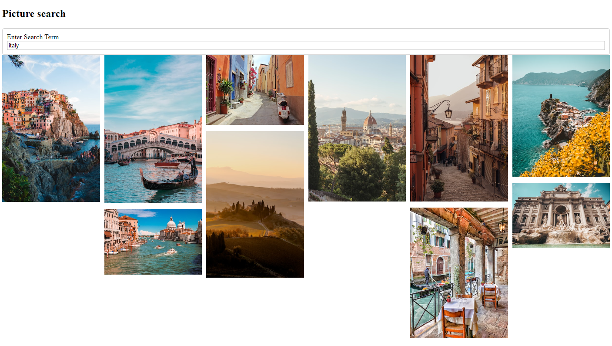

# Creating a picture search page

This was a react practice project created to allow a user to enter a search term and show the images for this term using an external API [Unsplash](https://unsplash.com/).

It was created in order to practice the following:

- Handling of text inputs by creating a piece of state, creating an event handler to watch for the 'onChange' event, getting the value from the input when onChange occurs, taking this value and updating the state and finally passing the state to the input as the value prop.
- The use of async and await to tell JS to wait for a request to finish before moving on.
- Creating a callback function in order to pass information from the parent component to the Child component and back to its parent.
- The requirment for keys to be used whenever we have a list of elements i.e. everytime we do a map. Keys must be a string/number, unique to its list and added to the top most JSX element in the list, in order to work correctly.